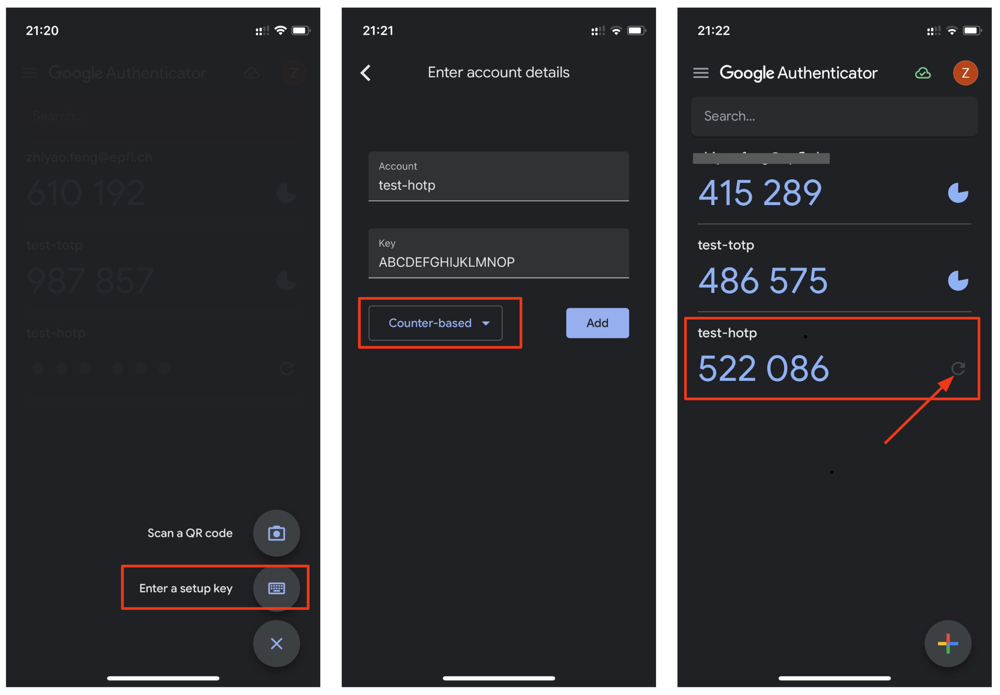
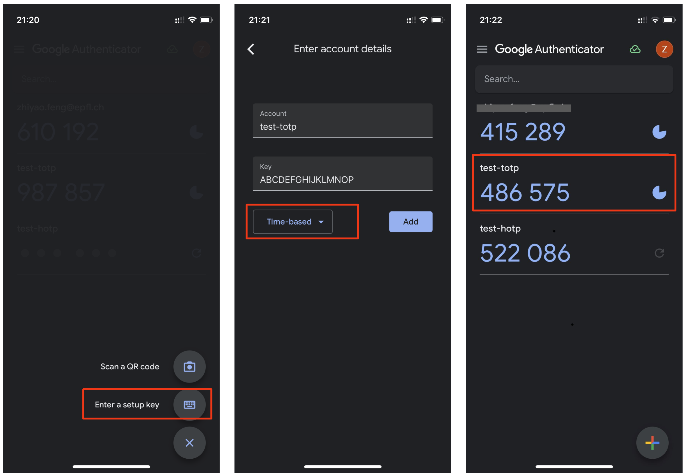

# COM-402 Cookie Tampering, HMAC and Authentication

- [Exercise 1: Cookie tampering](#exercise-1-cookie-tampering)
- [Exercise 2: HMAC for cookies](#exercise-2-hmac-for-cookies)
  - [Implementation](#implementation)
    - [Cookie](#cookie)
  - [Testing your solution](#testing-your-solution)
  - [Workbench lab](#workbench-lab)
    - [Server side](#server-side)
    - [Client side](#client-side)
- [Exercise 3: Client-side password verification](#exercise-3-client-side-password-verification)
- [Exercise 4: Authentication](#exercise-4-authentication)
  - [Part 4a: HOTP calculation](#part-4a-hotp-calculation)
  - [Part 4b: TOTP calculation](#part-4b-totp-calculation)


**Never use your actual GASPAR password on COM-402 exercises (if the login form is not Tequila).**

In this lab we are going to dig into the web interfaces security. 
To start the web server run:

```bash
docker run -it -p 80:80 com402/hw3ex13
```

For the other exercises (Exercises 2 and 4) the docker images to use are pointed out in the respective document subsection.

**Note**: the servers we use in this homework do not encrypt their traffic (you can check it because it uses HTTP through the default port 80, while normally an encrypted connection would be using HTTPS in port 443), we will explore this idea further in Homework 8.

## Exercise 1: Cookie tampering

You can access this exercise at `http://localhost/static/ex1.html`. Your goal is to login as an administrator and "Hack & Spy" on someone.
It seems the authentication mechanism they use for identifying their admins is severely broken. Can you bypass their login page (at `http://localhost/static/ex1/login.html`) and defeat them?

The exercise title may give you a tip or where to look at, if nothing seems clear, check out [how to represent data](https://en.wikipedia.org/wiki/Binary-to-text_encoding).

## Exercise 2: HMAC for cookies

In this exercise, you are asked to create a web-server that serves cookies to clients based on whether they are simple users or administrators of the system. However, as you have seen in the previous exercise, malicious users can easily tamper with cookies.

To protect their integrity and ensure only you can produce a valid cookie, you will add a Keyed-Hash Message Authentication Code (HMAC) as an additional field.

### Implementation

Implement your solution using Python 3 and a Flask server.

Your server should accept a `POST` login request of the form:

`{"username": user,"password": password}`

On the URL `/login`. The response must contain the below defined cookie.

Your server should have a second endpoint: it should accept `GET` requests on `/auth`. It can return a blank page, but the status codes should be:

- code 403 if no cookie is present or it has been tampered
- code 200 if the user is the administrator
- code 201 if the user is a simple user

#### Cookie

The cookie should have the same fields as in Exercise 1 with an additional field containing the HMAC.

Example of admin cookie:
`admin,1489662453,com402,hw3,ex2,admin,HMAC`

Example of user cookie:
`Yoda,1563905697,com402,hw3,ex2,user,HMAC`

It must be an administrator cookie if the username is `admin` and the password is `42`. Otherwise, it must be a regular (user) cookie. The name of the cookie is `LoginCookie`.

You can (and should) use a text encoding for the information like in the previous exercise.

### Testing your solution

Code your solution in a file named `server.py`. Here's a template:

```python
from flask import Flask

app = Flask(__name__)

cookie_name = "LoginCookie"

@app.route("/login",methods=['POST'])
def login():
    # implement here

@app.route("/auth",methods=['GET'])
def auth():
    # implement here

if __name__ == '__main__':
    app.run()
```

To test your server, use the following command in the same folder as `server.py`:

`docker run --read-only -v $(pwd):/app/student com402/hw3ex2`

**Note:** for scalability reasons, we send you the verification script in a Docker. With a bit of work, you can have access to the verification script; **looking at the verification script is not the intended way of doing exercises in Com402**. In practice, imagine that this docker is running somewhere else, i.e., you cannot read the verification script.

### Workbench lab
#### Server side

##### If you do not have Flask installed on your machine

You can run this one-liner in your terminal, in the same folder as your server.py script and it will start a docker container executing a Flask application based on your server.py file.

```bash
docker run --rm -v $(pwd):/app/student -p 5000:5000 -e FLASK_APP=server.py -e FLASK_DEBUG=1 -it com402/hw3ex2 sh -c "cd student && flask run --host 0.0.0.0"
```

Let's review the parameters for educational purpose. You can skip this if you do not want to better use Docker.

* `--rm` will ask Docker to remove the container of the graveyard of container when you will stop it. Used for clean management.
* `-v $(pwd):/app/student` will create a Docker volume between the folder you currently in and the _/app/student_ folder inside the Docker container. This will make available the server.py script to Flask
*  `-p 5000:5000` will map the port 5000 of the container to the port 5000 of your host. 5000 is the default port used by Flask
* `-e` allows to define some environment variable in the container. For this purpose, we need to set the entry script for the Flask server as well as setting the debug mode for Flask. This allows to reload automatically Flask when you change the server.py file.
* `-it` tells Docker we want to execute a command which is located just after the name of the image we want to create a container from. The command `sh -c "cd student && flask run --host 0.0.0.0"` will create a shell and execute `cd student && flask run --host 0.0.0.0`. We will move in the _student_ folder (corresponding to the _/app/student_ folder we mapped in the volume) and start Flask. The `--host` param of Flask will make it answer to every requests coming from anyone (required to query the application from our host).

When you do not need the server, you can `CTRL+C` to leave the program. The container will be killed and removed. Nice and clean.

##### If you have Flask installed on your machine

Testing it is also very simple! We provide a way for you to test the final code, but debugging simple mistakes will be painstakingly long if you have to invoke a docker instance for every test. Here are a few tips to make your life easier.

First of all, using a terminal, go to the location of your `server.py` file, and launch these two commands:
```bash
export FLASK_APP=server.py # file of your server
export FLASK_ENV=development # say it's for dev purpose
```
Note that these will last in the current terminal, and you will have to re-launch them every time you open a new one. Then, type the following:
```bash
flask run
```
This will launch a flask server, in _debug_ mode. Each time you make a modification in the python file, the server will automatically restart to take into account the changes!

#### Client side
Now, to easily query the server, open a new terminal, and open a python interpreter (command: `python3`). You'll be using `requests`, a fairly standard wrapper for HTTP requests. requests' _sessions_ are very useful to conduct a sequence of operations (`GET`, `POST`,...) while keeping cookies (among others). Here are a few useful commands:
```python
import requests

# create a session
session = requests.session()

# perform a GET
session.get("http://url_or_ip_address:port")

# perform a POST with a payload
session.post("http://url_or_ip_address:port/some/path",
             data={"field1": "value1", "field2": "value2"})

# inspect your cookies
print(session.cookies)

# modify your cookies
session.cookies.update({"name1": "value1"})
```

With a server in debug mode, and this interpreter ready, you can simply do modifications to the server, save, go to the interpreter, and launch a test command. And the window in which you launched the server will inform you of any python errors, with the adequate stacktrace.

## Exercise 3: Client-side password verification

This exercise uses the same docker as exercise 1.
If you stopped the docker from the first exercise run: 

```bash
docker run -it -p 80:80 com402/hw3ex13
````

You need to bypass the authentication on at `http://localhost/static/ex3.html`.

## Exercise 4: HOTP and TOTP 

The objective of this exercise is for you to learn how one-time passwords are calculated by implementing the open standard HOTP and TOTP algorithms in Python with basic cryptographic primitives.

### Part 4a: HOTP Calculation

HOTP (HMAC-based One-Time Password) algorithm is an OTP (One-Time Password) algorithm based on HMAC (Hash-based Message Authentication Code). HMAC algorithm was published in February 1997 (in [RFC-2104](https://datatracker.ietf.org/doc/html/rfc2104)) and HOTP algorithm was published in December 2005 (in [RFC-4226](https://datatracker.ietf.org/doc/html/rfc4226)).

#### Algorithm Details

HOTP provides an authentication method by symmetrically generating human-readable values on both the user and server side, and then comparing them to authenticate. Each value can be used only once.

HOTP values are calculated by the operation
$$
HOTP(K,C) = truncate(HMAC(K,C)) \mod 10^d
$$
Where,
- $K$ is the secret key
- $C$ is the counter which is incremented at each authentication
- $K$ and $C$ are shared by the user (in a token/mobile device) and by the server
- $d$ is the HOTP value size

<span id="hotp_impl"></span>
In practice, padding is required to keep the block size aligned. So the HMAC algorithm is implemented as
$$
HMAC(K,C) = H((K' \oplus opad) || H((K' \oplus ipad) || C)) \\
K' = 
\begin{cases}
H(K) & \text{K is larger than block size} \\
K & \text{Otherwise}
\end{cases}
$$
Where,
- $K$ is the secret key
- $C$ is the counter which is incremented with each authentication
- $H$ is a hash algorithm
- $ipad$ is the block-sized inner padding which consists of repeated value `0x36`
- $opad$ is the block-sized outer padding which consists of repeated value `0x5c`
- $||$ denotes concatenation
- $\oplus$ denotes bitwise `xor`

The truncate operation consists of,
- Taking the HMAC low-order 4 bits
- Using them as a byte index `i`
- Selecting 4 bytes starting at byte index `i`
- truncate(HMAC) = HMAC[`i`:`i+4`] & 0x7fffffff

Here is a truncate operation example.
```
-------------------------------------------------------------
| HMAC Byte Index                                           |
-------------------------------------------------------------
|00|01|02|03|04|05|06|07|08|09|10|11|12|13|14|15|16|17|18|19|
-------------------------------------------------------------
| HMAC Byte Value                                           |
-------------------------------------------------------------
|1f|86|98|69|0e|02|ca|16|61|85|50|ef|7f|19|da|8e|94|5b|55|5a|
-------------------------------***********-----------------+-
```

- HMAC low-order 4 bits is 0xa (see the `+` sign underlining)
- The byte index i is 10 = 0xa
- The selected 4 bytes starting at index 10 are 0x50ef7f19 (see the `*` sign underlining)
- Then we mask the first byte with 0x7f and get the truncated HMAC

#### Implement and Verify

Now your task is to implement the HOTP algorithm with the following configuration with library `base64` (for base 32 decoding the secret key) and `hashlib` (for the hashing operation):
```
Hash algorithm: SHA-1
Block size: 64 bytes
HOTP value size: 6
Secret key: ABCDEFGHIJKLMNOP (in base 32)
```

[PyOTP](https://pyauth.github.io/pyotp/) is a Python library for generating and verifying one-time passwords.
After finishing your implementation, you can verify if the results are correct by comparing them with the HOTP values generated by PyOTP (install it with `pip install pyotp`).

For example, the following code snippet generates values corresponding to counters 1 to 5.
```Python
import pyotp
hotp = pyotp.HOTP(secret_key)
hotp_values = [(hotp.at(x)) for x in range(0,5)]
for i in range(len(hotp_values)):
    print('HOTP value corresponding to counter ' + str(i + 1) + ' is '+ hotp_values[i])
```

Another method for verifying whether your implementation is correct is using Google Authenticator. 

Click on the `+` sign in the lower right corner after entering the app, configure the setup key as the figure shows, and then you can see the generated values on the main page, changing after refreshing (equivalent to counter++).


### Part 4b: TOTP Calculation
TOTP (Time-based One-Time Password) algorithm is an extension of HOTP algorithm. TOTP algorithm was published in May 2011 (in [RFC-6238](https://datatracker.ietf.org/doc/html/rfc6238)). 

Like HOTP, TOTP is an OTP (One-Time Password) algorithm based on HMAC. However, instead of incrementing a counter after each authentication like HOTP, TOTP takes the current time to calculate the counter. 

Specifically, the time is typically divided into fixed time intervals (e.g., 30 seconds), which must be agreed upon by the server and user. The current time is then divided by the interval duration to create a time step value, which is used as part of the input to the HMAC function.

#### Algorithm Details

Same as HOTP, TOTP values are calculated by the operation
$$
HOTP(K,C) = truncate(HMAC(K,C)) \mod 10^d
$$
Where,
- $K$ is the secret key which is kept secret and shared by the user (in a token/mobile device) and by the server
- **Note that: $C$ is the counter which is calculated with the current time**
- $d$ is the TOTP value size

The current time counter is calculated by the operation 
$$
C = (T - T_o) / T_x 
$$
where,
- $T$ is the current time (e.g. unix time)
- $T_o$ is the epoch (e.g. unix epoch is 0)
- $T_x$ is the time interval duration between 2 TOTP

After getting the current time counter ($C$), the HMAC algorithm implementation is the same as in [HOTP calculation](#hotp_impl).

#### Implement and Verify

We can then implement the TOTP algorithm with a similar configuration as in HOTP, using library `base64` (for base 32 decoding the secret key), `hashlib` (for the hashing operation), and `time` (for getting the current time):
```
Hash algorithm: SHA-1
Block size: 64 bytes
TOTP value size: 6
Time interval duration: 30 seconds
Secret key: ABCDEFGHIJKLMNOP (in base 32)
```

Run your code together with the following [PyOTP](https://pyauth.github.io/pyotp/) version to verify the implementation correctness.
```Python
import pyotp
import time
totp = pyotp.TOTP(secret_key)
for i in (range(4)):
    totp_value = totp.now()
    print('TOTP value corresponding to time ' + str(int(time.time())) + ' is ' + str(totp_value))
    if (i < 3):   
        print('     Waiting '+ str(duration) + ' seconds ', end = '')
        for j in range (duration):
            print('.', end = '')
            time.sleep(1)
        print()
```

We can also use Google Authenticator to verify the correctness of the TOTP values you generated. 

Click on the `+` sign in the lower right corner after entering the app, configure the setup key as the figure shows, and then you can see the generated values on the main page, automatically refreshing every 30 seconds.



P.S. You can refer to [this blog](http://nebelwelt.net/blog/2022/0711-2nd_shmactor.html) if you'd like to make the EPFL VPN login process a bit easier and have a better understanding of TOTP!
