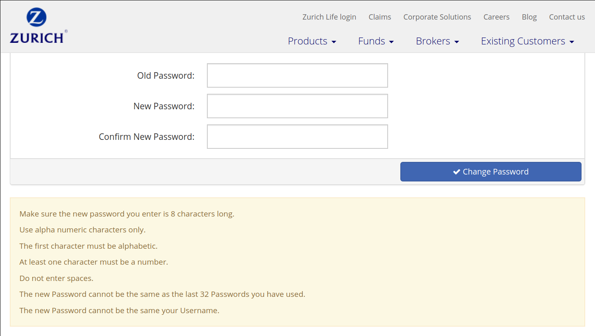

# COM-402 Password Cracking and PAKE Implementation Homework

- [Exercise 1: [attack] Password Cracking](#exercise-1-attack-password-cracking)
  - [Part 1a: Brute force attack](#part-1a-brute-force-attack)
  - [Part 1b: Dictionary attack with rules](#part-1b-dictionary-attack-with-rules)
  - [Part 1c: Dictionary attack with salt](#part-1c-dictionary-attack-with-salt)
- [Exercise 2: [attack] Use rainbow tables](#exercise-2-attack-use-rainbow-tables)
  - [What's the point?](#whats-the-point)
  - [Who are we attacking?](#who-are-we-attacking)
  - [The character set](#the-character-set)
  - [Generate a rainbow table](#generate-a-rainbow-table)
    - [The reduction functions](#the-reduction-functions)
    - [Computing the table](#computing-the-table)
  - [Attacking the hashes](#attacking-the-hashes)
  - [Is this feasible?](#is-this-feasible)
  - [Additional "theoretical" questions](#additional-theoretical-questions)
- [Exercise 3: PAKE Implementation](#exercise-3-pake-implementation)
  - [Protocol](#protocol)
  - [Implementation](#implementation)
  - [Network](#network)
  - [Encoding](#encoding)
  - [Hashing](#hashing)
  - [Exponentiations](#exponentiations)
  - [Randomness generation](#randomness-generation)
  - [Constants](#constants)

## Exercise 1: [attack] Password Cracking

The objective of this exercise is for you to crack some passwords. The exercise consists of three parts. In each part, the setting is slightly different, modifying the way the cracking should be executed.

For each part, please find the set of passwords to crack as a list of hash digests. We do not provide a docker container for this session as no specific environment is required. Later, we will release a solution written in Python.

### Part 1a: Brute force attack
In this part you should implement a brute-force attack. Passwords are randomly generated from the set of lowercase letters and digits (‘abcd...xyz0123...9’) and have length 4, 5, or 6 characters. Generated passwords are then hashed with SHA-256 and corresponding hexdigests are sent to you in the file.

The list of SHA-256 digests you need to crack is:

- `7c58133ee543d78a9fce240ba7a273f37511bfe6835c04e3edf66f308e9bc6e5`
- `37a2b469df9fc4d31f35f26ddc1168fe03f2361e329d92f4f2ef04af09741fb9`
- `19dbaf86488ec08ba7a824b33571ce427e318d14fc84d3d764bd21ecb29c34ca`
- `06240d77c297bb8bd727d5538a9121039911467c8bb871a935c84a5cfe8291e4`
- `f5cd3218d18978d6e5ef95dd8c2088b7cde533c217cfef4850dd4b6fa0deef72`
- `dd9ad1f17965325e4e5de2656152e8a5fce92b1c175947b485833cde0c824d64`
- `845e7c74bc1b5532fe05a1e682b9781e273498af73f401a099d324fa99121c99`
- `a6fb7de5b5e11b29bc232c5b5cd3044ca4b70f2cf421dc02b5798a7f68fc0523`
- `1035f3e1491315d6eaf53f7e9fecf3b81e00139df2720ae361868c609815039c`
- `10dccbaff60f7c6c0217692ad978b52bf036caf81bfcd90bfc9c0552181da85a`

What can you say about the computational time required? Is this kind of attack parallelizable?

### Part 1b: Dictionary attack with rules
In the previous part, you implemented the brute force attack and faced one of its drawbacks. Unfortunately, people very rarely use random passwords. Instead they use some common words and sometimes modify them slightly. This is a fortunate fact for password crackers, because they can use ‘dictionary attacks’ to crack the passwords more efficiently than with brute-force. In this part you should implement one such dictionary attack. We generate a password by selecting a word from a large dictionary and then randomly applying some of the common user modifications:

- capitalize the first letter and every letter which comes after a digit (for example: ‘com402class’ becomes ‘Com402Class’). If you are using Python, this is easily achieved by ‘title()’ function from string module (‘com402class’.title() will give you ‘Com402Class’)
- change ‘e’ to ‘3’
- change ‘o’ to ‘0’ (that’s small letter ‘o’ to zero)
- change ‘i’ to ‘1’

Note that those operations are not all commutative.
(For instance, ‘window’ can become ‘W1ndow’, or ‘w1nd0w’, or W1Ndow,...)

Examples of dictionaries can be found online (e.g. https://wiki.skullsecurity.org/Passwords). You can use some of them in this homework (hint: the "leaked passwords" can be quite useful).

The list of SHA-256 digests you need to crack is:

- `2e41f7133fd134335f566736c03cc02621a03a4d21954c3bec6a1f2807e87b8a`
- `7987d2f5f930524a31e0716314c2710c89ae849b4e51a563be67c82344bcc8da`
- `076f8c265a856303ac6ae57539140e88a3cbce2a2197b872ba6894132ccf92fb`
- `b1ea522fd21e8fe242136488428b8604b83acea430d6fcd36159973f48b1102e`
- `3992b888e772681224099302a5eeb6f8cf27530f7510f0cce1f26e79fdf8ea21`
- `326e90c0d2e7073d578976d120a4071f83ce6b7bc89c16ecb215d99b3d51a29b`
- `269398301262810bdf542150a2c1b81ffe0e1282856058a0e26bda91512cfdc4`
- `4fbee71939b9a46db36a3b0feb3d04668692fa020d30909c12b6e00c2d902c31`
- `55c5a78379afce32da9d633ffe6a7a58fa06f9bbe66ba82af61838be400d624e`
- `5106610b8ac6bc9da787a89bf577e888bce9c07e09e6caaf780d2288c3ec1f0c`


What do you observe compared to part 1a?


### Part 1c: Dictionary attack with salt
In the previous part of the exercise you implemented a dictionary attack. You should notice that once you have a dictionary you can compute the hashes of all those words in it, and create a lookup table. This way, each next password you want to crack is nothing more than a query in the lookup table. To tackle this problem, passwords are usually ‘salted’ before hashing. Salt is exactly two characters long and it contains only hexadecimal characters. In this part of the exercise you should implement another attack using a dictionary. We generate a password by simply selecting a random word from a dictionary and appending a random salt to it. The password is then hashed with SHA-256 and hexdigest and salt are available to you. Your task is to crack the passwords using a dictionary.

The list of SHA-256 digests you need to crack and the salt (in brackets) used are:

- `962642e330bd50792f647c1bf71895c5990be4ebf6b3ca60332befd732aed56c` (`b9`)
- `8eef79d547f7a6d6a79329be3c7035f8e377f9e629cd9756936ec233969a45a3` (`be`)
- `e71067887d50ce854545afdd75d10fa80b841b98bb13272cf4be7ef0619c7dab` (`bc`)
- `889a22781ef9b72b7689d9982bb3e22d31b6d7cc04db7571178a4496dc5ee128` (`72`)
- `6a16f9c6d9542a55c1560c65f25540672db6b6e121a6ba91ee5745dabdc4f208` (`9f`)
- `2317603823a03507c8d7b2970229ee267d22192b8bb8760bb5fcef2cf4c09edf` (`17`)
- `c6c51f8a7319a7d0985babe1b6e4f5c329403d082e05e83d7b9d0bf55876ecdc` (`94`)
- `c01304fc36655dd37b5aa8ca96d34382ed9248b87650fffcd6ec70c9342bf451` (`7f`)
- `cff39d9be689f0fc7725a43c3bdc7f5be012c840b9db9b547e6e3c454a076fc8` (`2e`)
- `662ab7be194cee762494c6d725f29ef6321519035bfb15817e84342829728891` (`24`)

Why is it a good idea to salt the passwords? Estimate the complexity required in this part if the salts were not provided. What additional security countermeasures could you think of?


**Note1:** The SHA-256 digest of a password 'psswd' is the result of SHA-256(psswd). The digest of a salted password with salt XX is SHA-256(psswdXX).

**Note2:** Not all dictionaries are the same, be aware that if you implement the attack correctly but you can’t crack the passwords, then you might be using a dictionary which doesn’t contain all the words as the dictionary we used.

**Note3:** In order to check the passwords, just compute the hash of the word (with or without salt):

- macOS cli: `echo -n "psswd" | shasum -a 256`
- unix cli: `echo -n "psswd" | shasum -a 256`
- Windows: look into _Microsoft File Checksum Integrity Verifier_ or use an online hasher

**Note4:** The attacks you implement might take some time when you run them. Depending on your hardware and your implementation, the attacks may run for more than 30 minutes.

## Exercise 2: [attack] Use rainbow tables
In this exercise, you will attack a website with weak password requirements, using a rainbow table. In the first part, you will generate a rainbow table, and store it as a file. Then, you will use it to attack some passwords.

### What's the point?
Using a rainbow table is a great application of the [space/time tradeoff](https://en.wikipedia.org/wiki/Space%E2%80%93time_tradeoff). It's like precomputing everything, but you don't have to store it. You only store a fraction of that. If you used 100 reduction functions, you will store (roughly) only one percent of all the precomputed hashes.

This is great for attacking a lot of passwords, if you have some spare space. The more space you use (the more passwords you precompute), the faster will the following attacks be. If your table is relatively "thin" (few reduction functions), you won't save much space compared to storing everything, but each lookup will be faster. With a "fat" table (many reduction functions), you save more space but each lookup is more costly. Hence, the tradeoff.

### Who are we attacking?
Suppose Zürich Insurance was to be hacked, and a dump of the passwords (the attached file `dump_hashes.txt`)<sup>[1]</sup> was leaked. Because they are not completely oblivious to security, the passwords are not stored in plaintext, but hashed, using **SHA256 without salt**. You wish to reverse the hashes (and inform the users of the vulnerability, because you are a White Hat Hacker).

<sub>[1] Note: obviously, this dump is not real, and doesn't come from a leak at Zürich insurance; we generated it randomly using the rules for the character set we define below</sub>

### The character set
As we saw earlier, trying to reverse hashes without any idea of the charset of passwords is generally a bad idea. Fortunately, Zürich Insurance has some very _very_ weak requirements for passwords:


(credits to [dumb password rules](https://github.com/dumb-password-rules/dumb-password-rules) for the image)

Now, that's awesome (for us). The passwords we are attacking are **only alphanumeric** and with a **length of exactly 8**. We are changing two requirements here: The passwords must also be lowercase, and we relax the condition on the first character (it can also be a number). The first change is to make the hacks "more feasible", while the latter is for convenience when defining the reduction functions.

In short, the password set will be as follow:

- Exactly 8 characters,
- Alphanumeric (a-z and 0-9),
- Lowercase.

### Generate a rainbow table
Now that you have your passwords set, you can start thinking about the rainbow table. The 3 steps are the following:

1. Define a hash function (SHA256)
2. Define a set of reduction functions (see below)
3. Compute all rows of the table, and store the first and last columns (plaintexts).

#### The reduction functions
There are plenty of convenient reduction functions that can be used. Before starting, try to think of one. This exercise is not as trivial as it seems. How can you go from a hexadecimal hash, to an arbitrary set of characters, of fixed length?

Arguably the most practical for us, is one that makes use of viewing a number in a different base. Let's first define _one_ reduction function, and the others will follow easily.

Let's say you have a (short) hash: `a9b6f58c0`. Viewing this as an integer in base 16, you get the corresponding integer `45557438656` (base 10). Then, you consider your charset: for this example, we will use `abcdefghijkl` (that's kind of base 12); of course, a base 36 charset (a-z0-9) will have to be used for the final exercise. Express your integer in the new base, character by character, until you reach your desired length (8, for us). You get your first character by doing `45557438656 % 12 = 4`; you then take the 5th character of the charset, that is `e`. Now repeat the operation on `45557438656 // 12 = 3796453221` (an integer division). Do this until you have a string of the desired length. The above string will yield the reduction `ejfgbbfl` (for a length 8 and the 12-characters charset). Make sure you understand why and how.

But with only one reduction function, it is not a rainbow table, it's a [Hellman Table](https://ee.stanford.edu/~hellman/publications/36.pdf). The very power of rainbow table is the use of **multiple** reduction functions. With this method, we can easily define an arbitrary number of different functions: Once you've converted your hash to an integer, add to it the index of the column. `45557438656` will become `45557438686` in column `30`.

#### Computing the table
Each row begins with a different string. You can choose to generate a random string or, even simpler, pass the row number through the reduction function. Then, you apply successively the hashing and reductions until you have the final plaintext. After that, you store the first and last plaintext (preferably in a structure like a dictionary). Once you have computed all the rows, write the table to a file (we suggest to use [pickle](https://docs.python-guide.org/scenarios/serialization/#pickle-nested-data)).

It's up to you to choose the dimensions of the table.

### Attacking the hashes
Now that you have an "offline" table, time to attack hashes. [Wikipedia](https://en.wikipedia.org/wiki/Rainbow_table#Example) has a great explanation for this. With your hash, apply the last reduction function to it (say, $f_{99}$). This gives a potential password. Look if it is in the last column of your table. If not, start over: take your hash, apply the two last reduction functions ($f_{98}$, then hash, then $f_{99}$), and look if it is in the last column. Repeat until you have a match.

Once you have a match, take the first plaintext of the row, and recompute the whole row, until you find your target hash (or the end of the row).

It is possible that you don't find the preimage. In this case, continue the process of adding reduction functions, until you have another match. Take a second to think why this is possible.

Take the dump(`dump_hashes.txt`) and reverse as many hashes as possible. How many can you find with your table?

### Is this feasible?
A quick note on feasibility here. Obviously, the password space we are attacking is huge ($36 ^ 8 = 2.8  \times 10 ^ {12}$). Your table can't cover everything, it will have a certain _success rate_. The bigger the table, the higher the rate. You are not supposed to reverse all of them. We obtained a success rate of ~3.5% with a 10M rows, 1k columns table.

### Additional "theoretical" questions
Now that you are an expert on rainbow tables, here are some additional questions. Try to answer them.

1. How do you compute the success rate of your table?
2. What are the advantages of making the table "fatter" (more columns)? And "taller" (more rows)?
3. How do height and width relate to the size (on disk) of the table, and the lookup time?
4. The state-of-the-art cracking uses multiple tables. What is the point?
5. What would be the (estimated) size of a table to have a >95% success rate on this password space?
6. Can you parallelize the processes of creating the table and hacking?
7. How would you modify the reduction functions to match exactly the Zürich Insurance requirements? How would that affect your success rate?

## Exercise 3: PAKE Implementation

**Important disclaimer:** In this exercise, we ask you to implement a cryptographic protocol. This is a challenging and interesting task, notably to get a good understanding of what is going on. However, in real life, implementing your own cryptographic primitives is generally a **bad idea**. Read more about this [here](https://motherboard.vice.com/en_us/article/wnx8nq/why-you-dont-roll-your-own-crypto) or [here](https://security.stackexchange.com/questions/18197/why-shouldnt-we-roll-our-own).

This exercise is about implementing a password-authenticated key agreement protocol, [PAKE](https://en.wikipedia.org/wiki/Password-authenticated_key_agreement). PAKE serves two main purposes: derivation of a cryptographically secure shared key from a low entropy password and proving the knowledge of a secret password to each other without actual transmission of this password. This is useful for a lot of applications. For example, ProtonMail is an end-to-end encrypted email service provider which uses a PAKE protocol named Secure Remote Password protocol ([SRP](https://en.wikipedia.org/wiki/Secure_Remote_Password_protocol)).

You have to implement the client part of the SRP protocol that interacts with our server using websockets.

### Protocol

The web server implements a simplified version of the SRP protocol described in the [RFC-2945](https://datatracker.ietf.org/doc/html/rfc2945). `g` and `N` are two public and previously chosen constants (below we will provide them).

```
Client                                      Server
-------                                     --------

U = email (string)
sends U (UTF-8 encoded string)
                          ---------->
                                            salt = randomInt(32)
                                            sends salt (UTF-8 encoded Hexadecimal String)
                          <----------
a = randomInt(32)
A = g^a % N
sends A (UTF-8 encoded Hexadecimal String)
                          ---------->
                                            x = H(salt || H(U || ":" || PASSWORD))
                                            v = g^x % N
                                            b = randomInt(32)
                                            B = (v + g^b) % N
                                            sends B (UTF-8 Encoded Hexadecimal String)
                          <----------
u = H(A || B)
x = H(salt || H(U || ":" || PASSWORD))
S = (B - g^x) ^ (a + u * x) % N
                                            u = H(A || B)
                                            S = (A * v^u) ^ b % N
```

At the end of the protocol, both parties should have the same shared secret `S`.
To validate the exercise, send `H(A || B || S)` to the server at the end!

You should be convinced that both sides get the same secret at the end, we encourage you to take a look at the [RFC-2945](https://datatracker.ietf.org/doc/html/rfc2945) for more details.


### Implementation

This exercise can in theory be solved using any programming language you want; however, we strongly recommend to use Python3, for which you are given code snippets below.

In Python >= 3.5, you can use [this library for websockets](https://websockets.readthedocs.io/en/stable/); an example for creating a websocket is given [here](https://websockets.readthedocs.io/en/stable/).

### Network

All communication happens through a websocket channel on port 5000. You can create this channel by connecting to `ws://127.0.0.1:5000/`.

### Encoding

**String encoding**: In Python3, all strings (`str`) are by default UTF-8 encoded. But some libraries (such as hashing) work with `bytes`. You can convert between the two easily:
* `byte.decode() -> str`
* `str.encode() -> byte`

You can specify arguments to `encode` and `decode` in order to decode to (or encode from) another encoding (say, ASCII for example), but that likely won't be needed there.

**Number encoding**: All numbers (A, B, salt) follow the same procedure:
* To use in mathematical functions (pow, mod,...), keep as integers
* Otherwise, first encode them to an UTF-8 hexadecimal string, then encode them to a bytes string (see above). Used for hashing or sending to the websocket.

Note that sending a string as bytes or utf-8 through a websocket is similar, the `websocket` library will decode the message to a `utf-8` string upon arrival.

Numbers you receive from the websocket (from our server) are encoded the same way (hexadecimal utf-8)

Here's a sample code in Python3:

Encoding:
```python
utf8_hex = format(12345, "x").encode()
await websocket.send(utf8_hex)
hash.update(utf8_hex)
```

Decoding:
```python
# Number is received as UTF-8 encoded hexadecimal string
utf8_hex_message =  await websocket.recv()
# Hexadecimal string is converted back to an integer
integer_message = int(utf8_hex_message, 16)
```

### Hashing

In this exercise, you have to hash (a mix of) strings and numbers. The encoding is consistent with what is described above; always use bytes-encoded hexadecimal strings.

```python
import hashlib
h = hashlib.sha256()
h.update(format(12345, "x").encode())
h.update(some_other_bytes_hex_string)
# h.hexdigest() returns an hexadecimal representation of the hash
utf8_hex_result = h.hexdigest()
```

### Exponentiations

In the second message sent by the client, you're supposed to compute `A = g^a % N`. Note that the python expression `g**a % N` will *not* work! Due to the priority of `**`, this would first compute `g**a`, then apply `mod N` (think about the size of `a` in bits). However, this expression can be efficiently computed as `pow(g,a,N)`, which uses standard modular exponentiation techniques (such as computing `a mod \phi(N)` first, then applying the mod at every multiplication).

### Randomness generation

The function `randomInt(32)` should generate a **number** from 32 random bytes. Look into `os.urandom` and `int.from_bytes`

### Constants

```python
EMAIL = "your.email@epfl.ch"
PASSWORD = "correct horse battery staple"
H = sha256
N = EEAF0AB9ADB38DD69C33F80AFA8FC5E86072618775FF3C0B9EA2314C9C256576D674DF7496EA81D3383B4813D692C6E0E0D5D8E250B98BE48E495C1D6089DAD15DC7D7B46154D6B6CE8EF4AD69B15D4982559B297BCF1885C529F566660E57EC68EDBC3C05726CC02FD4CBF4976EAA9AFD5138FE8376435B9FC61D2FC0EB06E3
g = 2
```

**Note:** The modulus N is given here in hexadecimal form, make sure you transform it into an integer before using it.

To test your client, use the following command in the same folder as `client.py`:

`docker run --read-only -v $(pwd):/app/student com402/hw4ex3`
